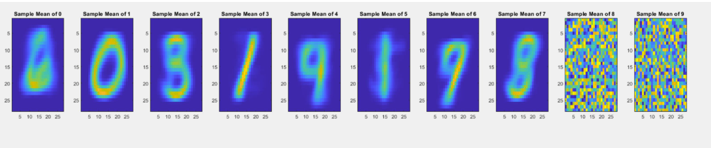
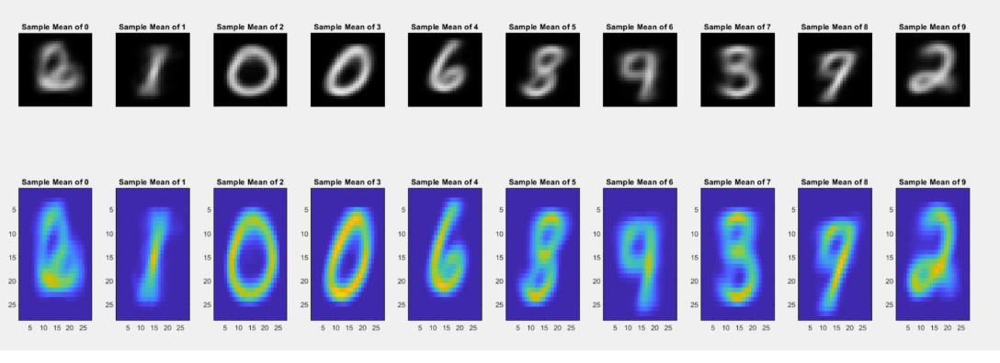
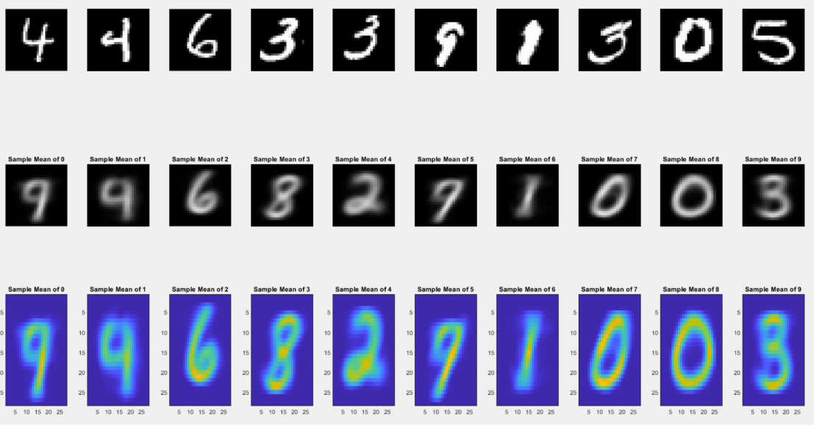
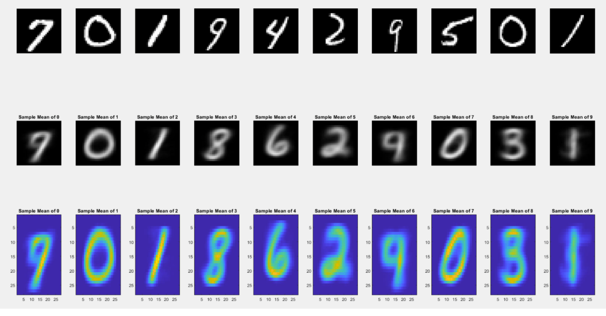
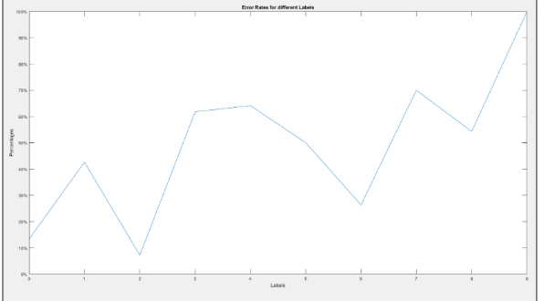
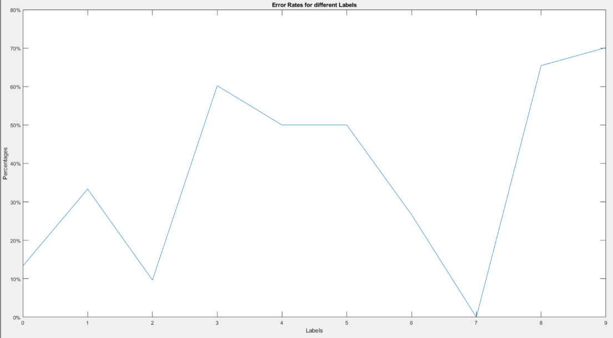

# K-Means
In this unsupervisied model, we use a K-means approach to identify all the labels and use them to classify the numbers.

## Identified Labels Through K-Means

## Initial Condition
Instead of identifying labels without any priori information, we select 10 random images as a starting point.

The image below shows the final sample means through K-Means.

## Classification
With the means created from an initial image, we select the best sample means and use it to identify their respective labels. 

The image shown below identifies a test image on the first row with the sample mean it best identifies to.

### Second Iteration
We run a second iteration doing the same process of finding the best sample means and using it to identify a test image.

#### First Iteration

### 0 : 13.3333333333333%
### 1 : 42.6086956521739%
### 2 : 7.14285714285714%
### 3 : 61.7977528089888%
### 4 : 64.1509433962264%
### 5 : 50.0000000000000% No Label
### 6 : 26.3157894736842%
### 7 : 70.0000000000000%
### 8 : 54.2857142857143%
### 9 : 100%
### Total Error Rate: 48.96
#### Second Iteration

### 0 : 13.3333333333333%
### 1 : 33.3333333333333%
### 2 : 9.67741935483871%
### 3 : 60.2150537634409%
### 4 : 50.0000000000000% No Label
### 5 : 50.0000000000000% No Label
### 6 : 26.6666666666667%
### 7 : 0%
### 8 : 65.4545454545455%
### 9 : 70.1298701298701%
### Total Error Rate: 37.88

### Reasoning
The reason why the error rates for 4, 7, 9 were high is due to their close resemblance to each other. If we look at 2, we can see how strongly bright it is and close to the class mean it is and how there are no other class means close to '2'. Another example is 0, because although we have another class mean, the "best" representing class mean yielded a lower error rate. As such, to have a lower error rate, we want to have images that are close to the class means of the labels possible.

Initialization is also super important because the more close the images are to the class mean, the more accurate our results will be. For example, the class 3 had the lowest because although it was similar to 8, the highlighting features of 3 were much brighter than the 8 features.

The highest errors were 4 and 9 because of how similar they were. 8 was also high due to it's close resemblance to 3.

The closer the initializing images are to the class means, the better our unsupervised model will become.