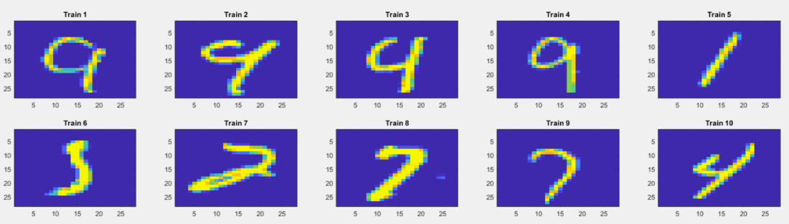
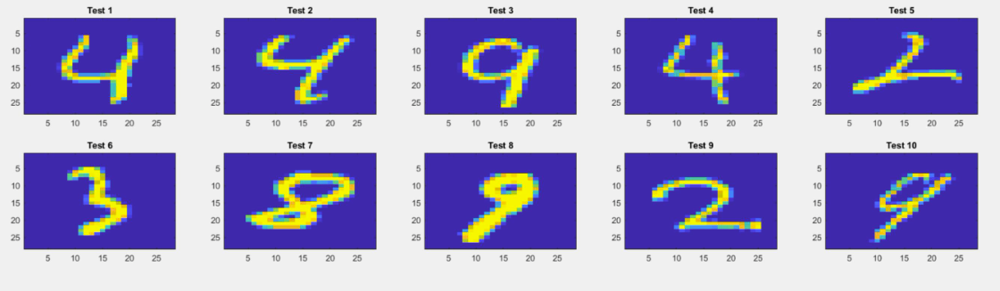
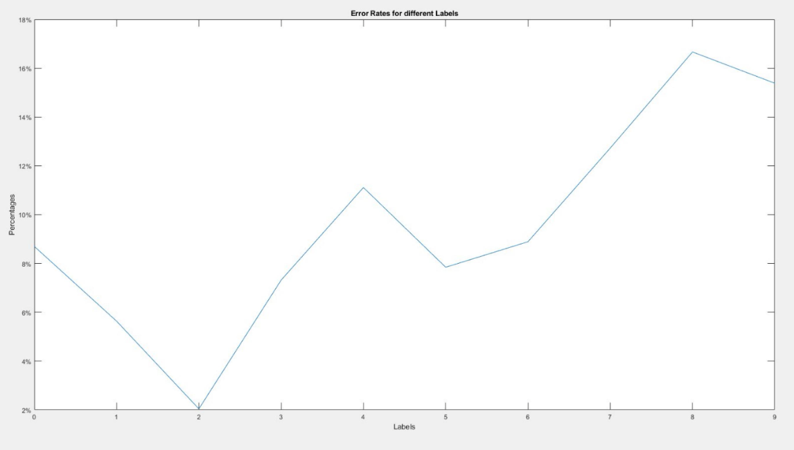

# Euclidean Distance Metric
In this NN Classifier, we utilize the most basic metric of Euclidean Distance.

## Training Images

## Testing Images

### Error Rates

### 0 : 8.695621739104%
### 1 : 5.63380281690141%
### 2 : 2.04081632653061%
### 3 : 7.31707317073171%
### 4 : 11.1111111111111%
### 5 : 7.84313725490196%
### 6 : 8.88888888888888%
### 7 : 12.7272727272727%
### 8 : 16.6666666666667%
### 9 : 15.3846153846154%
### Total Error Rate: 9.40%
