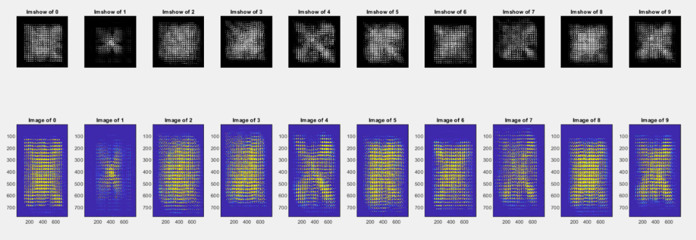
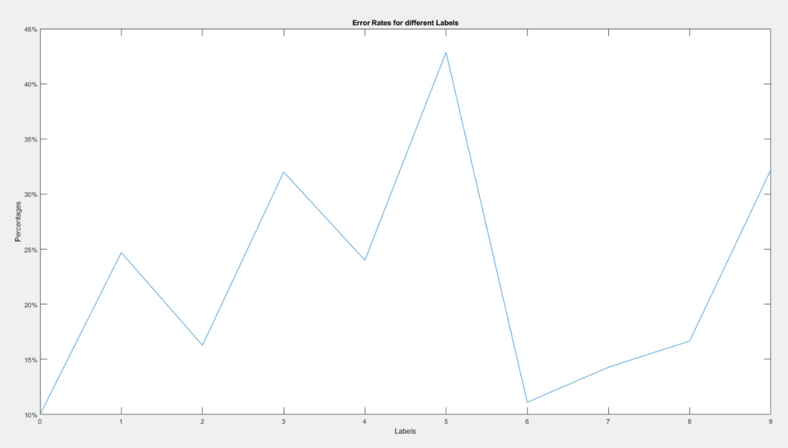

# Mahalobian Distance Metric
In this NN Classifier, we utilize the next iteration: Mahalobian Distance. This metric incorporates probability which involves covariance matrices of each label's likelihood.

## Sample Mean

## Covariances

### Error Rates
### 0 : 10.0000000000000%
### 1 : 24.6913580246914%
### 2 : 16.2790697674419%
### 3 : 32.0000000000000%
### 4 : 24.0000000000000%
### 5 : 42.8571428571429%
### 6 : 11.1111111111111%
### 7 : 14.2857142857143%
### 8 : 16.6666666666667%
### 9 : 32.2033898305085%
### Total Error Rate: 24.20%

### Reasoning For Higher Error Rates
As we see in the covariance matrix images, we see that the covariances for each labels are not positive definite. This means that the mahalobian distance will not work as it only works with positive definite matrices x'Mx. A non-positive definite matrix will imply a coupling with other labels, making it noisier to classify.
