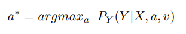
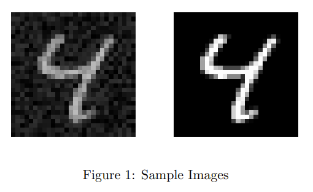
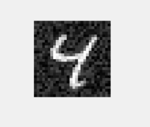
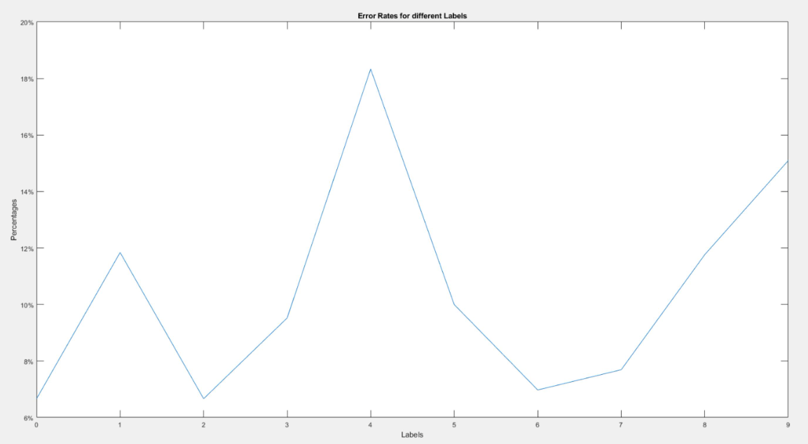
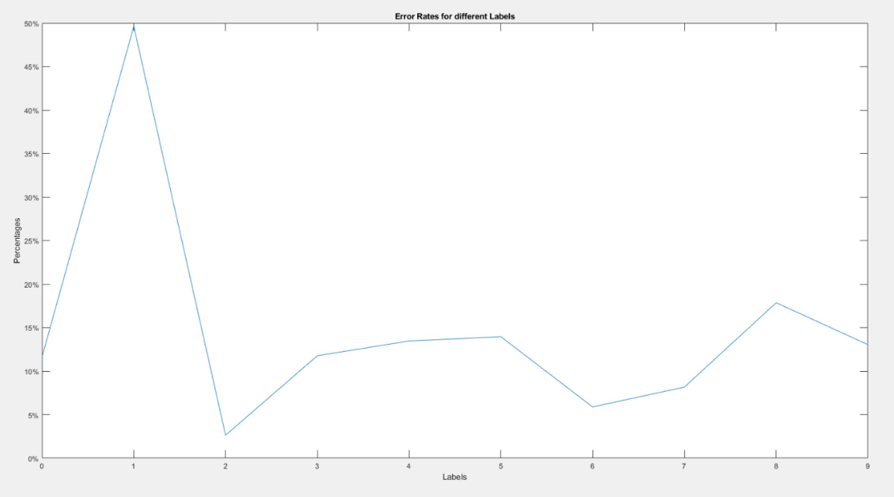

# Maximum Likelihood Estimation
In this NN Classifier, we use Maximum Likelihood Estimation computed from the training data to use in our classifier.

## Weight

We compute a, but for sake of academic integrity, is not shown here.

With the computed a, we de-noisify the image so that our NN classifier can have a better classification rate.

###  Error Rates
### Different Iterations

### 0 : 11.6279069767442%
### 1 : 49.6240601503759%
### 2 : 2.63157894736842%
### 3 : 11.7647058823529%
### 4 : 13.4615384615385%
### 5 : 13.9534883720930%
### 6 : 5.88235294117647%
### 7 : 8.16326530612245%
### 8 : 17.8571428571429%
### 9 : 13.0434782608696%
### Total Error Rate: 10.8% to 21.2%
